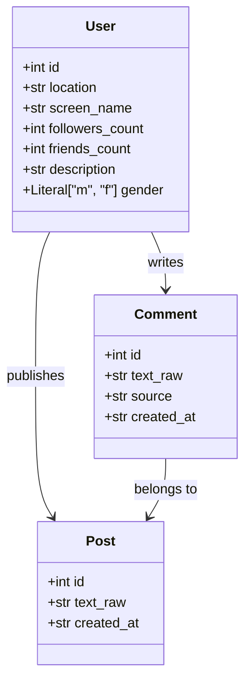
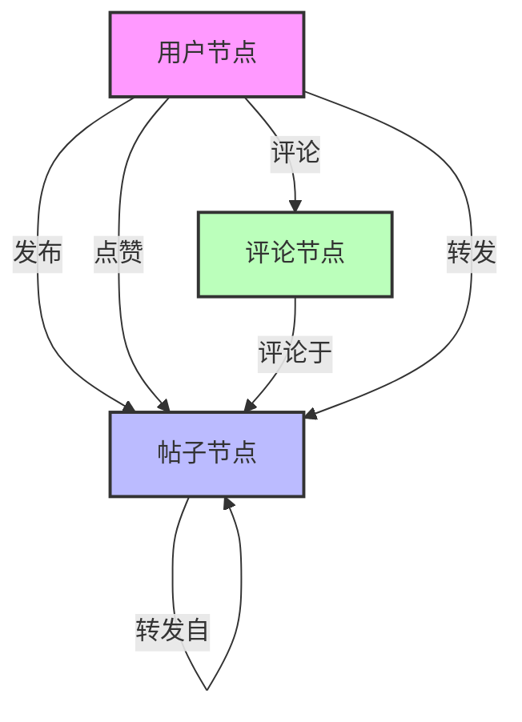

# 微博社交网络爬虫

这是一个基于Python的微博社交网络爬虫项目，可以从指定的微博帖子开始，递归抓取其互动关系网络，并将数据存储到Neo4j图数据库中。

## 功能特点

- 从指定微博ID开始递归抓取社交网络
- 获取点赞、评论、转发等互动数据
- 支持多层级转发关系追踪
- 数据自动导入Neo4j图数据库

## TODO

- [ ]  完善异常处理机制，包括网络连接异常、API限流、数据解析错误等场景的处理
- [ ]  使用代理池加速爬取，支持动态切换代理IP，避免被微博限流或封禁

## 环境要求

```
Python 3.11+
Neo4j 4.0+
pip install -r requirements.txt
```

## 快速开始

### 0. 启动Neo4j容器

使用Docker运行Neo4j数据库：

```bash
docker run \
    --name neo4j \
    -p 7474:7474 -p 7687:7687 \
    -d \
    neo4j
```

容器启动后，可以通过以下方式访问：

- Neo4j Browser界面：http://localhost:7474
- Bolt连接地址：bolt://localhost:7687

确保Neo4j容器正常运行后，再继续后续步骤。

### 1. 安装依赖

```bash
git clone https://github.com/Helio609/weibo-social-network-crawler
cd weibo-social-network-crawler
pip install -r requirements.txt
```

### 2. 配置文件

在.env文件中配置以下信息：

```bash
NEO4J_URI=bolt://localhost:7687
NEO4J_USER=your username
NEO4J_PASSWORD=your password
```

还需要将微博的cookies填入cookies.json文件中：

```json
{
  "SINAGLOBAL": "",
  "UOR": "",
  "SCF": "",
  "XSRF-TOKEN": "",
  "SUB": "",
  "SUBP": "",
  "ALF": "",
  "_s_tentry": "",
  "Apache": "",
  "ULV": "",
  "WBPSESS": ""
}
```

请将从浏览器中获取的微博cookies填入对应字段。

### 3. 运行爬虫

使用以下命令运行爬虫：

```bash
python main.py -e xxxxxx yyyyyy

# 或者使用单个入口
python main.py -e xxxxxx
```

其中：

- -e/--entry：指定一个或多个微博帖子ID作为爬取入口
- 可以通过-h参数查看更多选项说明

## 数据模型



Neo4j图数据库中的节点和关系设计如下：



## 注意事项

- 需要有效的微博cookie才能访问数据
- 请遵守微博的爬虫规范和速率限制
- 大规模抓取建议使用代理池

## 贡献指南

欢迎提交Pull Request或Issue来帮助改进项目。在提交代码前，请确保：

- 代码符合PEP 8规范
- 添加了必要的测试用例
- 更新了相关文档

## 许可证

本项目采用MIT许可证。详见LICENSE文件。